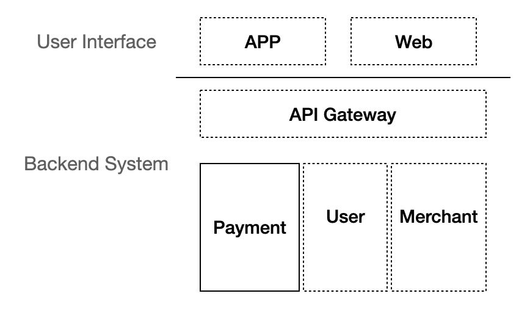

# Architecture

The following diagram describes the high level services needed for a mobile payment system.

* App/Web: could be either mobile app or web system rendered by browsers
* API gateway: responsible for authorization, authentication, request routing, composition and etc.
* User: user managerment sub-system.
* Merchant: Merchant management sub-system.
* Payment: the core payment engine

To begine with, opendigital pay will start with the most part of the solution: the core payment engine. For the other parts of the system, we will also provide basic implementation for demostration purpose at current stage. Once the core payemnt engine is completed, we will move focus to other sub-systems.

