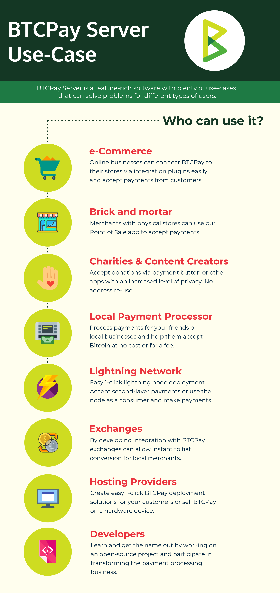

# OpenDigitalPay Use Cases

Built with the community in mind, BTCPay Server is a feature-rich software with **plenty of use-cases** that can solve problems for different types of users.

who want to use opendigitalpay
-companies want to launch mobile payment solutions
<!-- -companies want to become a FayFac. -->

The software usage is by no means limited to the groups of users mentioned in this document.

## Merchants

By **choosing BTCPay Server to process payments**, merchants are:

* Saving money (no fees, no subscriptions)
* Cutting out the middle-man (Payments go directly to their wallet)
* Enhancing privacy for their customers (no address re-use, no information leaks to third parties)
* Saving time (easy integration and installation)
* Protecting themselves from interference in their business (self-sovereignty)

### Online Store

Merchants running an **e-commerce business** can easily [deploy BTCPay Server](./Deployment.md) and connect it to their store via integration plugins in just a few clicks.

BTCPay Server checkout is no different to any other payment gateway. The customer gets an invoice. They pay it by scanning a QR code or by copy-pasting the amount and the address. When their payment is confirmed, the merchant is notified via the e-commerce software, and can ship the item.

Take a look at [our demo online store](https://store.btcpayserver.org/).

### Physical Store

For brick and mortar stores, BTCPay Server has a [web-based Point of Sale](./Apps.md#point-of-sale-app). Similarly to the online store, the customer is presented with an invoice that he can pay on the spot. The **POS app** can be run on any web-connected device.

Take a look at [our demo POS app](https://mainnet.demo.btcpayserver.org/apps/3utBTfSKkW4gK7aQMd2hW5Bh9Fpa/pos).

## Self-sovereign individuals

**Privacy-minded individuals** can use BTCPay Server internal wallet for their everyday crypocurrency transactions without providing a private key. For self-hosted servers, the [internal wallet](./Wallet.md) relies on a full node, significantly enhances the privacy. [Hardware wallet integration](./HardwareWalletIntegration.md) allows the usage of a hardware wallet with a [full node](https://en.bitcoin.it/wiki/Full_node) and avoids leaks to a third-party server.

## Developers

BTCPay Server community is amiable and open-minded. **Developers** can not only learn a lot and get their name out by working on an open-source project, but also participate in transforming the payment processing business.

---

These are some of the many ways in which you can use BTCPay. Unleash your creativity and feel free to build your own solutions to solve problems.
